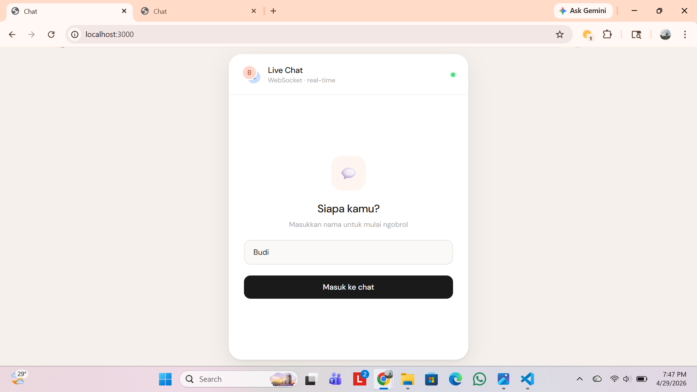
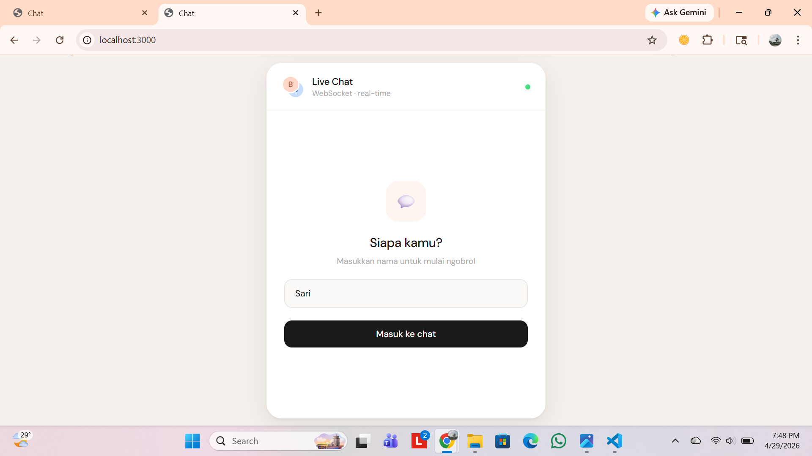
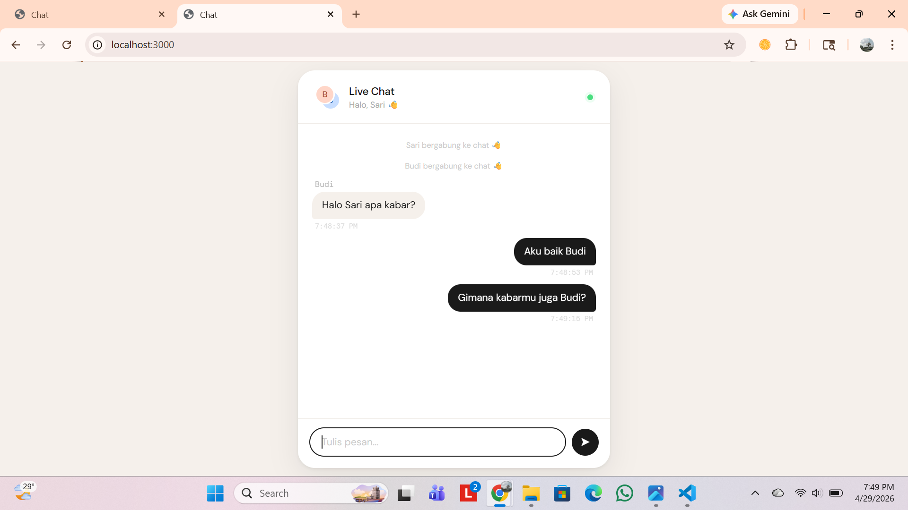
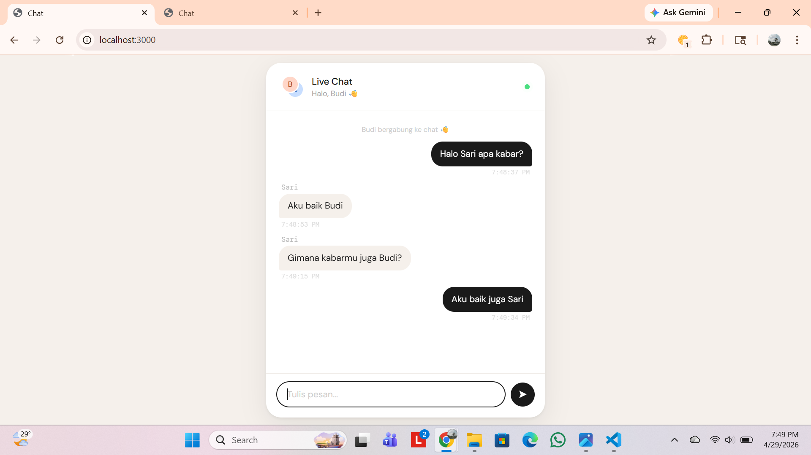
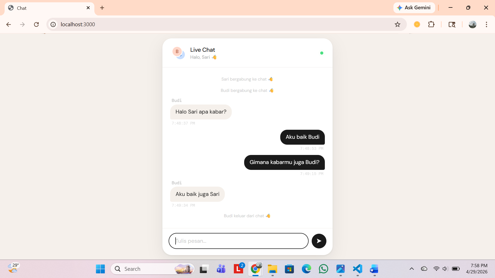

# UTS_Pemrograman_Web2

Nama: Bagus aditya hermawan
Nim: 312410382
Kelas: I241C

## Tampilan Dashboard
Dashboard menampilkan login dengan usernam. Setelah login, laluakan ditampilkan layar chat antara 2 orang secara real-time

## Struktur folder
```
websocket-chat/
│──server.js
├── package.json
├── package-lock.json
└── README.md
```

## Hasil Eksperimen
##### .
##### .
Pada tab pertama mengisi Ussername Budi dan pada tab kedua mengisi Username Sari.

##### .
##### .
Pada kedua gambar tersebut. Terdapat notifikasi pada masing-masing tab ketika ke-dua user tersebut bergabung kedalam chat. kemudian, ketika Budi mencoba memulai pesan pertama, pesan tersebut langsung muncul pada tab yang digunakan oleh Sari. Hal ini membuktikan bahwa WebScoket tidak harus meminta ulang ketika permbaruaan terjadi.
##### .
Ketika Budi keluar dari percakapan maka sistem akan mengirim informasi bahwa Budi telah keluar dari chat.

Dari hasil eksperimen tersebut, ketika server dijalankan menggunakan perintah node server.js, terminal menampilkan bahwa server telah aktif di alamat http://localhost:3000. Untuk menguji komunikasi secara real-time, dua tab browser dibuka secara bersamaan pada alamat tersebut, kemudian masing-masing tab diisi dengan username yang berbeda. Pada tab pertama menggunakan Username "Budi" dan tab kedua menggunakan Username "Sari". 

Hasil awal yang terlihat adalah munculnya notifikasi otomatis. Saat Budi masuk, tab milik Sari langsung menampilkan pesan sistem “Budi bergabung ke chat” tanpa perlu melakukan refresh halaman. Hal serupa juga terjadi ketika Sari bergabung. Ini menunjukkan bahwa server mampu mendeteksi koneksi baru dan secara langsung mengirimkan informasi tersebut ke seluruh client yang sedang aktif.
